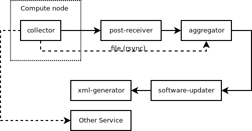

# Basic flow

## sams-collector

The [*sams-collector*](sams-collector.md) is using a *pidfinder* module to detect PIDs related to the running job.

The default *pidfinder* ([*sams.pidfinder.Slurm*](pidfinder/Slurm.md)) uses the Linux CGroup and how it is used within
Slurm to group processes in an job to collect PIDs.

The PIDs are feeded into the *sampler* modules to gather metrics from the job.

During and after the job the data sent from the *samplers* are sent to the *output* modules.

One or more output module can be used at any time.

The two basic output modules are [*sams.output.File*](output/File.md) and [*sams.output.Http*](output/Http.md).

The first one writes files to a filesystem. Either an shared filesytem or to a local filesystem that needs to 
be transported to a master node after the completed job for further processing with for example rsync.

The [*sams.output.Http*](output/Http.md) module send the same data using the http:// protocol to a receiving webservice.

The [*sams-collector*](sams-collector.md) can also send data to other serviecs like graphite or other graphing services to provide
real time usage of different metrics. An example module that sends data to and graphite carbon service is 
provided ([*sams.output.Carbon*](output/Carbon.md)) and an sampler that fetch
data from the Nvidia SMI command about GPU usage ([*sams.sampler.NvidiaSMI*](sampler/NvidiaSMI.md)) are available.

## post-receiver

The [*sams-post-receiver*](sams-post-receiver.md) can be used to receive the output 
from the [*sams.output.Http*](output/Http.md) module and collected to disk.

## aggregator

The [*sams-aggregator*](sams-aggregator.md) is used to parse the output from the [*sams-collector*](sams-collector.md) using a set of 
aggreagors. For SUPR/SAMS software accounting the [*sams.aggregator.SoftwareAccounting*](aggregator/SoftwareAccounting.md) 
module are used.

To pick up the files from the [*sams-collector*](sams-collector.md) or [*sams-post-receiver*](sams-post-receiver.md) a
*loader* is used. Currently only [*sams.loader.File*](loader/File.md) is available.

[*sams.aggregator.SoftwareAccounting*](aggregator/SoftwareAccounting.md) store the output of the aggregation into an Sqlite3 database
that are later used with the [*sams-software-updater*](sams-software-updater.md).

## software-updater

[*sams-software-updater*](sams-software-updater.md) uses two type of modules to convert executable paths into software.

The [*sams.backend.SoftwareAccounting*](backend/SoftwareAccounting.md) is used to fetch non updated path and convert them
into softwares with the help of the [*sams.software.Regexp*](software/Regexp.md) that uses regexps to match different paths into software.

## software-extractor

[*sams-software-extractor*](sams-software-extractor.md) is used to extractor softwares from the database and write the xml files that can be sent to SAMS.

The [*sams.backend.SoftwareAccounting*](backend/SoftwareAccounting.md) is used to fetch jobs and softwares and with help of [*sams.xmlwriter.File*](xmlwriter/File.md) convert them into xml files.
